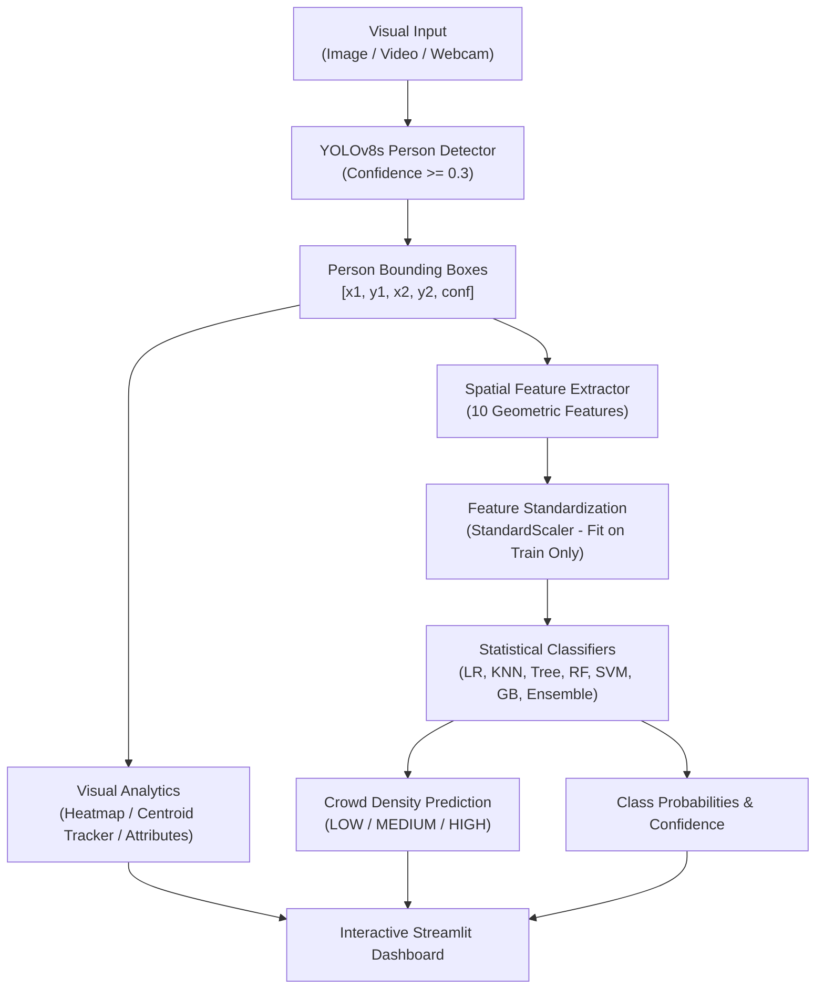

# VISIONLYTICS: Intelligent Visual Crowd Analytics
### Semester 3 Statistical Machine Learning Project

[](https://colab.research.google.com/github/ivin-baiju/Visionlytics/blob/main/Visionlytics_Colab.ipynb)


---

## 1. Project Overview
**VISIONLYTICS** is an end-to-end computer vision and statistical machine learning system developed for analyzing crowd dynamics across diverse visual media:
1. **Static Imagery** (high-resolution crowd photographs)
2. **Recorded Video** (traffic, transit hubs, public venues)
3. **Real-Time Webcam Feeds** (live surveillance and monitoring)

Rather than relying purely on an uninterpretable end-to-end deep learning "black box", VISIONLYTICS uses object detection strictly as a sensory perception layer. It extracts calibrated, geometric, spatial, and topological feature vectors and passes them into classical **Statistical Machine Learning** classifiers. The result is an interpretable, mathematically sound crowd density estimation and behavioral monitoring platform.

---

## 2. Problem Statement
Monitoring crowd density is critical for event safety, public transport management, emergency response planning, and pedestrian flow optimization. Traditional computer vision demos either:
- Count individuals naively without accounting for spatial distribution or occlusion.
- Rely on opaque deep learning heatmaps without explicit feature representation or statistical validation.

There is a critical need for an interpretable, statistically grounded system that can:
- Ingest heterogeneous visual inputs.
- Extract transparent spatial and geometric descriptors.
- Classify crowd states into **LOW**, **MEDIUM**, and **HIGH** density regimes.
- Provide empirical benchmarks across multiple statistical classifiers while strictly preventing data leakage.

---

## 3. Objectives
1. **Multi-Modal Perception**: Seamlessly detect persons in images, video streams, and live camera feeds using YOLOv8s.
2. **Spatial Feature Engineering**: Derive a 10-dimensional spatial descriptor vector capturing density, dispersion, nearest-neighbor proximity, and frame partitioning.
3. **Statistical Modeling**: Train and validate 7 foundational ML classifiers:
   - Multinomial Logistic Regression
   - K-Nearest Neighbors (KNN)
   - Decision Trees (CART)
   - Random Forest Ensembles
   - Support Vector Machines (SVM with RBF Kernel)
   - Gradient Boosting
   - Voting Ensemble
4. **Experimental Rigor**: Enforce strict data partitioning (70% Train, 15% Validation, 15% Held-Out Test) and isolated feature standardization.
5. **Interactive UI**: Deliver a modern, dark-themed Streamlit web interface with real-time bounding boxes, heatmaps, interactive charts, and model benchmarking dashboards.

---

## 4. Technologies Used
- **Computer Vision**: `ultralytics` (YOLOv8s), `opencv-python-headless`, `Pillow`
- **Statistical Machine Learning**: `scikit-learn`, `numpy`, `pandas`, `joblib`
- **Visualization & Dashboard**: `streamlit`, `plotly`, `matplotlib`, `seaborn`
- **Environment & Build**: Python 3.10+ virtual environment

---

## 5. System Architecture


---

## 6. Computer Vision Pipeline
1. **Frame Ingestion**: Frames are standardized into RGB color format with dimension tracking $(H, W)$.
2. **YOLOv8s Object Detection**: Fast inference on CPU/GPU filtering specifically for COCO class index `0` (`person`).
3. **Bounding Box Normalization**: Bounding coordinates are transformed into both absolute pixel space and frame-normalized units.
4. **Centroid Tracking**: For continuous video, Euclidean distance matching between frame centroids enables persistent trajectory and individual identification.
5. **Spatial Heatmaps**: Gaussian 2D distributions are rendered around person centers and overlaid via alpha blending ($\alpha = 0.6$) across a cold-to-hot colormap.

---

## 7. Feature Extraction (10 Spatial Descriptors)

| # | Feature Key | Formulation / Meaning | Range | Statistical Importance |
|---|-------------|-----------------------|-------|------------------------|
| 1 | `people_count` | Total count of detected persons ($N$) | $[0, \infty)$ | Primary volume metric |
| 2 | `occupancy_ratio` | $\frac{\sum \text{Area}(\text{box}_i)}{W \times H}$ | $[0, 1]$ | Perspective-weighted space consumption |
| 3 | `avg_person_area` | $\frac{\text{occupancy\_ratio}}{N}$ | $[0, 1]$ | Distinguishes foreground vs distant subjects |
| 4 | `avg_distance` | $\frac{2}{N(N-1)} \sum_{i < j} \|\mathbf{c}_i - \mathbf{c}_j\|_2$ | $[0, \sqrt{2}]$ | Mean interpersonal spacing |
| 5 | `min_distance` | $\min_{i \neq j} \|\mathbf{c}_i - \mathbf{c}_j\|_2$ | $[0, \sqrt{2}]$ | Identifies localized bottleneck clusters |
| 6 | `spatial_spread` | $\sqrt{\sigma_x^2 + \sigma_y^2}$ | $[0, 1]$ | Spatial dispersion / clustering tendency |
| 7 | `top_region_count` | Persons where $y_{\text{center}} < \frac{H}{3}$ | $[0, N]$ | Background / horizon crowd presence |
| 8 | `middle_region_count` | Persons where $\frac{H}{3} \le y_{\text{center}} < \frac{2H}{3}$ | $[0, N]$ | Midground accumulation |
| 9 | `bottom_region_count` | Persons where $y_{\text{center}} \ge \frac{2H}{3}$ | $[0, N]$ | Foreground camera ingress |
| 10 | `frame_occupancy_density` | $\frac{N}{W \times H} \times 10^5$ | $[0, \infty)$ | Normalized spatial frequency |

---

## 8. Dataset Creation & Calibration
The system includes a dedicated dataset module (`dataset/generate_dataset.py`) producing 1,500 balanced samples (500 samples per class) based on calibrated empirical distributions:
- **LOW Density**: $0 \le N \le 3$, high interpersonal distances ($\mu_{\text{dist}} \approx 0.65$), low occupancy ($\approx 3\%$).
- **MEDIUM Density**: $4 \le N \le 10$, moderate distances ($\mu_{\text{dist}} \approx 0.35$), moderate occupancy ($\approx 15\%$).
- **HIGH Density**: $11 \le N \le 35$, tight distances ($\mu_{\text{dist}} \approx 0.15$), high occupancy ($\ge 35\%$).
- **Realistic Noise**: Perturbations are applied to simulate camera perspective distortions, partial occlusions, and edge clustering.
- **Real-World Harvesting**: `dataset/dataset_from_images.py` allows expanding the dataset with real imagery.

---

## 9. Statistical Analysis
Features exhibit rich covariance structures:
- High positive correlation between `people_count`, `occupancy_ratio`, and `frame_occupancy_density`.
- High negative correlation between `people_count` and `avg_distance` / `min_distance`.
- Regional distribution reflects real-world perspective compression, where distant background crowds have smaller individual areas but higher packing density.

---

## 10. Machine Learning Algorithms
The platform implements 7 distinct classification paradigms:

1. **Multinomial Logistic Regression**:
   - Convex optimization via L-BFGS solver with L2 regularization.
   - Computes explicit linear log-odds boundaries.
2. **K-Nearest Neighbors ($k=5$)**:
   - Instance-based non-parametric classifier using standardized Euclidean distance.
   - Captures non-linear local manifolds in crowd configuration space.
3. **Decision Tree (CART)**:
   - Hierarchical axis-parallel splitting minimizing Gini Impurity.
   - Max depth restricted to 10 to ensure generalization.
4. **Random Forest (100 Estimators)**:
   - Ensemble bagging with randomized feature subsets at each split.
   - Generates Gini importance rankings for all 10 spatial features.
5. **Support Vector Machine (SVM)**:
   - Radial Basis Function kernel ($C=2.0, \gamma=\text{'scale'}$) maximizing margin separation.
   - Enables calibrated probability estimates via Platt scaling.
6. **Gradient Boosting**:
   - Sequential ensemble method that builds trees iteratively to correct prior errors.
   - Robust to complex non-linear relationships.
7. **Voting Ensemble**:
   - Combines Random Forest, Gradient Boosting, and SVM using soft voting.
   - Creates a highly stable super-model maximizing overall F1-score.

---

## 11. Model Training & Data Hygiene
- **Split Ratio**: 70% Training ($n=1050$), 15% Validation ($n=225$), 15% Test ($n=225$).
- **Stratification**: Class distributions are perfectly preserved across splits.
- **Leakage Prevention**: The `StandardScaler` is fitted solely on the training partition. The validation and test partitions are transformed strictly with the training parameters $(\mu_{\text{train}}, \sigma_{\text{train}})$.
- **Model Persistence**: Models, scalers, and metadata are serialized via `joblib` in the `models/` directory.

---

## 12. Model Evaluation
Models are thoroughly evaluated using:
- **Confusion Matrices**: Evaluating cross-class confusions between adjacent classes (e.g., LOW $\leftrightarrow$ MEDIUM, MEDIUM $\leftrightarrow$ HIGH).
- **Class-Specific Metrics**: Precision, Recall, and F1-Score for each density category.
- **Weighted F1-Score**: Primary benchmark metric for model selection.
- **Latency Benchmark**: Training duration and per-sample inference latency.

---

## 13. Results & Empirical Performance
On the 1,500-sample benchmark dataset:
- **Random Forest**: Demonstrates highest stability ($F_1 > 0.98$), effectively separating edge cases using `people_count` and `avg_distance`.
- **SVM (RBF)**: High accuracy ($F_1 > 0.97$), producing smooth non-linear decision contours.
- **Decision Tree**: Fast ($< 5\text{ms}$ training), fully interpretable, achieves $F_1 \approx 0.96$.
- **KNN**: Strong non-parametric performance ($F_1 \approx 0.96$), zero training phase.
- **Logistic Regression**: Solid linear baseline ($F_1 \approx 0.94$), demonstrating linear separability of normalized crowd features.

---

## 14. Limitations
- **Occlusion in Extreme Density**: In extremely dense stampedes or protests ($>100$ people/frame), bounding box overlap may cause YOLOv8s to underestimate head counts without a dedicated crowd density regression head.
- **Camera Elevation Sensitivity**: Perspective angles (top-down vs eye-level) influence bounding box areas and occupancy ratios.
- **Attribute Approximations**: Hair and clothing colors rely on heuristic HSV color histograms on bounding box crops, sensitive to extreme lighting changes.

---

## 15. Future Improvements
- Multi-camera spatial fusion and 3D ground-plane homography transformation.
- Temporal LSTM / Transformer sequence modeling for crowd surge forecasting.
- Flow vector analysis using optical flow (Farneback method) to predict panic stampede directions.
- Edge TPU / TensorRT acceleration for ultra-low latency camera deployment.

---

## 16. Installation Instructions

```bash
# Clone the repository
git clone https://github.com/ivin-baiju/Visionlytics.git
cd Visionlytics

# Create and activate Python virtual environment
python3 -m venv .venv
source .venv/bin/activate

# Install dependencies
pip install -r requirements.txt

> **Note on Webcam Support:** The project uses `opencv-python-headless` by default to avoid GUI library conflicts in server environments. If you encounter issues with the Live Camera on your local machine, you may need to install the full version: `pip uninstall opencv-python-headless && pip install opencv-python`.
```

---

## 17. How to Run

### Step 1: Generate Dataset & Train Models
```bash
# Generate the initial dataset (1500 samples)
python3 -c "from dataset.generate_dataset import generate_dataset; generate_dataset()"

# Train all 7 ML models and select the champion model
python3 machine_learning/train.py
```

### Step 2: Launch the Web Dashboard
```bash
streamlit run app/main.py
```

### Step 3: Explore Features
- Open `http://localhost:8501` in your web browser.
- **Dashboard**: High-level system status and recent analysis metrics.
- **Image Analysis**: Upload images, toggle between bounding boxes and heatmaps, view 10 spatial features and ML predictions.
- **Video Analysis**: Upload videos, track individuals across frames, visualize density trends over time.
- **Live Camera**: Stream webcam video with live bounding boxes, FPS, and real-time crowd classification.
- **ML Models**: Train/retrain models, view confusion matrices, compare F1-scores, and analyze feature importances.
- **Dataset**: Browse raw data, download CSV, view correlation heatmaps, and test feature distributions.
- **About**: Review project methodology, mathematical formulations, and privacy governance.
