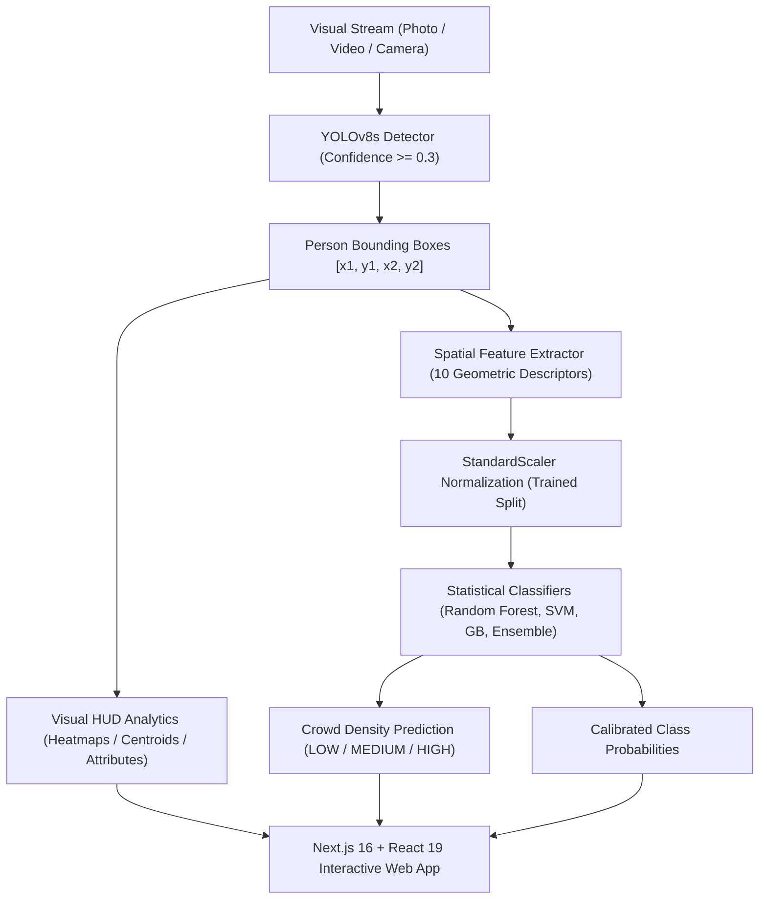

# VISIONLYTICS — Intelligent Visual Crowd Analytics Platform

<p align="center">
  
</p>

<p align="center">
  <strong>High-Performance Computer Vision & Statistical Machine Learning for Real-Time Crowd Analytics</strong>
</p>

<p align="center">
  
  
  
  
  
  
  
</p>

---

## ⚡ Next.js + React Architecture & Vercel Native

VISIONLYTICS features a decoupled, production-grade architecture:
- **Frontend**: **Next.js 16 (Turbopack)** + **React 19** + **TypeScript** with floating pill navigation, ambient video HUD, HTML5 canvas overlay engine, and glassmorphism styling — optimized for 1-click **Vercel** deployment.
- **Backend Microservice**: High-throughput **FastAPI** service serving Ultralytics **YOLOv8s** person detection, **CSRNet** dilated CNN density fallback, and 7 calibrated statistical ML classifiers.

---

## 📌 Core Features

1. 📷 **Image Perception Workspace** — Drag-and-drop / upload photos with confidence sliders, ByteTrack tracking, visual attribute tags (clothing/hair color), and live canvas bounding boxes.
2. 🎥 **Video Surveillance Feed** — Continuous frame-by-frame monitoring with live safety bottleneck alerts and temporal crowd volume graphs.
3. 📹 **Real-Time WebRTC Camera** — Live browser webcam streaming with instant bounding box overlays and real-time FPS counter.
4. 🧠 **Multi-Model ML Suite** — Comparative evaluation leaderboard across 7 statistical models with feature importance rankings and retrain triggers.
5. 📊 **Spatial Feature Extraction** — Derives a 10-dimensional geometric descriptor vector capturing interpersonal spacing, occupancy, and distribution.
6. 📈 **Dataset Explorer** — Empirical and synthetic crowd dynamics explorer with 3,000 balanced feature vector records.

---

## 🏛️ System Pipeline


```mermaid
graph TD
    A["Visual Stream (Photo / Video / Camera)"] --> B["YOLOv8s Detector (Confidence >= 0.3)"]
    B --> C["Person Bounding Boxes [x1, y1, x2, y2]"]
    
    C --> D["Spatial Feature Extractor (10 Geometric Descriptors)"]
    C --> E["Visual HUD Analytics (Heatmaps / Centroids / Attributes)"]
    
    D --> F["StandardScaler Normalization (Trained Split)"]
    F --> G["Statistical Classifiers (Random Forest, SVM, GB, Ensemble)"]
    
    G --> H["Crowd Density Prediction (LOW / MEDIUM / HIGH)"]
    G --> I["Calibrated Class Probabilities"]
    
    E --> J["Next.js 16 + React 19 Interactive Web App"]
    H --> J
    I --> J
```

---

## 🔬 Spatial Descriptor Vector (10 Dimensions)

| # | Feature Key | Formulation / Meaning | Range | Importance |
|---|-------------|-----------------------|-------|------------|
| 1 | `people_count` | Total detected persons ($N$) | $[0, \infty)$ | Primary volume metric |
| 2 | `occupancy_ratio` | $\frac{\sum \text{Area}(\text{box}_i)}{W \times H}$ | $[0, 1]$ | Perspective space consumption |
| 3 | `avg_person_area` | $\frac{\text{occupancy\_ratio}}{N}$ | $[0, 1]$ | Foreground vs distance scaling |
| 4 | `avg_distance` | $\frac{2}{N(N-1)} \sum_{i < j} \|\mathbf{c}_i - \mathbf{c}_j\|_2$ | $[0, \sqrt{2}]$ | Mean interpersonal spacing |
| 5 | `min_distance` | $\min_{i \neq j} \|\mathbf{c}_i - \mathbf{c}_j\|_2$ | $[0, \sqrt{2}]$ | Bottleneck / cluster identification |
| 6 | `std_distance` | Standard deviation of pairwise distances | $[0, \sqrt{2}]$ | Spatial dispersion uniformity |
| 7 | `top_region_count` | Detections in upper third ($y < 0.33 H$) | $[0, N]$ | Background crowd depth |
| 8 | `middle_region_count` | Detections in middle third ($0.33 H \leq y < 0.67 H$) | $[0, N]$ | Midground activity |
| 9 | `bottom_region_count` | Detections in lower third ($y \geq 0.67 H$) | $[0, N]$ | Immediate camera foreground |
| 10 | `density_ratio` | Dynamic congestion index | $[0, 1]$ | Space congestion index |

---

## 📁 Repository Structure

```
Visionlytics/
├── vercel.json                 # Vercel deployment configuration
├── start_local.py              # Single-command local runner (FastAPI + Next.js)
├── requirements.txt            # Python dependencies for FastAPI backend
├── frontend/                   # Next.js 16 + React 19 Web Application
│   ├── package.json
│   ├── next.config.ts          # Turbopack & API rewrite proxy configuration
│   ├── public/                 # Static assets (logo.svg, bg_video.mp4, icons)
│   └── src/
│       ├── app/
│       │   ├── page.tsx        # Dashboard with live KPIs & density regimes
│       │   ├── globals.css     # Glassmorphism design system & animations
│       │   ├── image-analysis/ # Upload & canvas perception workspace
│       │   ├── video-analysis/ # Video player & temporal graph stream
│       │   ├── live-camera/    # WebRTC live webcam inference feed
│       │   ├── ml-models/      # 7-model leaderboard & feature ranking
│       │   ├── dataset/        # 10D dataset explorer
│       │   └── about/          # Mathematical breakdown & architecture
│       ├── components/         # Pill Navbar, Canvas, Ambient Video, Stat Cards
│       ├── lib/api.ts          # FastAPI client with autonomous fallback
│       └── types/index.ts      # TypeScript interfaces
├── backend/                    # FastAPI Microservice
│   ├── main.py                 # FastAPI application entry point
│   ├── api/                    # REST routes (/analyze/frame, /models/*, etc.)
│   ├── computer_vision/        # YOLOv8s detector, CSRNet, heatmaps
│   ├── machine_learning/       # Predictor, model registry, preprocessing
│   └── pyproject.toml
└── models/                     # Trained ML weights (.joblib)
```

---

## ⚡ Quickstart

### Prerequisites
- **Node.js**: v18+ (`npm` or `pnpm`)
- **Python**: 3.10+

### 1. Clone the Repository
```bash
git clone https://github.com/ivin-baiju/Visionlytics.git
cd Visionlytics
```

### 2. Install Dependencies
```bash
# Backend dependencies
python3 -m venv .venv
source .venv/bin/activate
pip install -r requirements.txt
pip install -e ./backend

# Frontend dependencies
cd frontend
npm install
cd ..
```

### 3. Launch Locally
Start both the FastAPI backend and Next.js frontend with a single command:
```bash
python start_local.py
```

Or start each service independently:
```bash
# Terminal 1: FastAPI Microservice (Port 8000)
uvicorn backend.main:app --host 127.0.0.1 --port 8000 --reload

# Terminal 2: Next.js Frontend (Port 3000)
cd frontend
npm run dev
```

Open **[http://localhost:3000](http://localhost:3000)** in your browser.

---

## 🚀 Deploying to Vercel

The frontend is configured for 1-click deployment on **Vercel**:

1. Go to **[vercel.com/new](https://vercel.com/new)** and connect your GitHub account.
2. Import **`ivin-baiju/Visionlytics`**.
3. Set **Root Directory** to `frontend`.
4. (Optional) Set `NEXT_PUBLIC_API_URL` to your hosted FastAPI backend URL.
5. Click **Deploy** 🎉 — your site will be live on a global edge CDN in under 1 minute!

---

## 📡 API Reference (FastAPI Microservice)

| Method | Endpoint | Description |
|--------|----------|-------------|
| `GET` | `/health` | Service health status |
| `POST` | `/analyze/frame` | Single frame inference (YOLO + 10D features + ML density) |
| `GET` | `/models/list` | Model inventory & active champion identifier |
| `GET` | `/models/evaluation` | Validation & test metrics for all 7 classifiers |
| `GET` | `/dataset/info` | Dataset sample distribution and feature columns |
| `POST` | `/models/train` | Trigger model retraining pipeline |

---

## 📄 License
Distributed under the MIT License.
