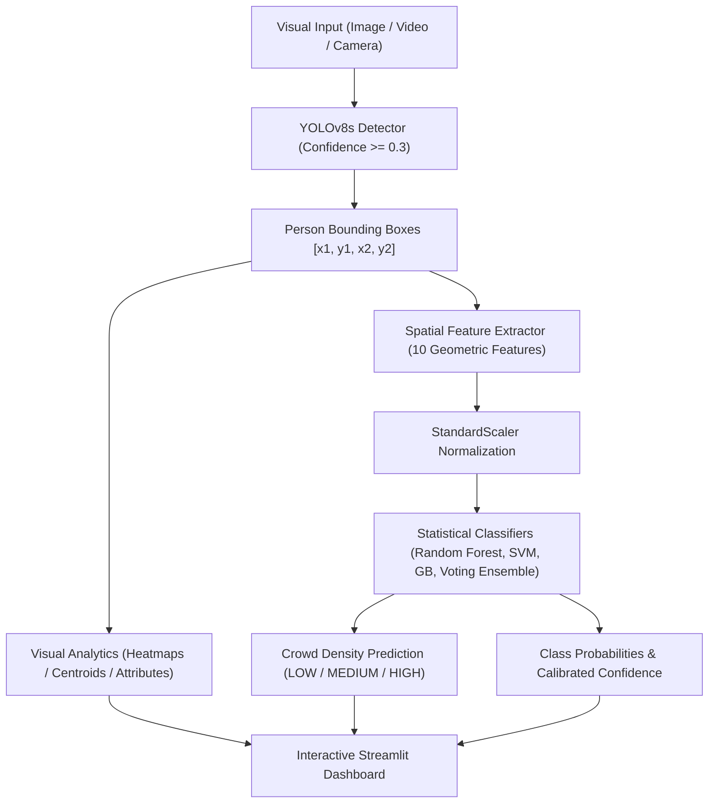

# VISIONLYTICS — Intelligent Visual Crowd Analytics Platform

<p align="center">
  
</p>

<p align="center">
  <strong>Intelligent Computer Vision & Statistical Machine Learning for Real-Time Crowd Analytics</strong>
</p>

<p align="center">
  <a href="https://visionlytics.streamlit.app"></a>
  
  
  
  
  
</p>

---

## 🚀 Live App

Explore the live web application on Streamlit Cloud:  
👉 **[visionlytics.streamlit.app](https://visionlytics.streamlit.app)**

---

## 📌 Overview

**VISIONLYTICS** is an end-to-end computer vision and statistical machine learning platform engineered to analyze crowd dynamics across diverse visual inputs:

1. 📷 **Static Imagery** — High-resolution crowd photographs and bottleneck analysis.
2. 🎥 **Recorded Video** — Temporal crowd flow tracking with centroid trajectory persistence.
3. 📹 **Real-Time Webcam** — Live surveillance and real-time density classification.
4. 🧠 **Multi-Model ML Benchmarking** — Comparative evaluation of 7 statistical classifiers.
5. 📊 **Spatial Density Mapping** — Gaussian kernel density heatmaps and proximity clustering.

Rather than relying purely on an uninterpretable deep learning "black box", VISIONLYTICS pairs **YOLOv8s** for sensory perception with **geometric & spatial feature engineering** and classical **Statistical Machine Learning** classifiers. For extreme dense crowds (>40 persons), a **CSRNet** dilated convolutional network is used as a density regression fallback.

---

## 🏛️ System Architecture


```mermaid
graph TD
    A["Visual Input (Image / Video / Camera)"] --> B["YOLOv8s Detector (Confidence >= 0.3)"]
    B --> C["Person Bounding Boxes [x1, y1, x2, y2]"]
    
    C --> D["Spatial Feature Extractor (10 Geometric Features)"]
    C --> E["Visual Analytics (Heatmaps / Centroids / Attributes)"]
    
    D --> F["StandardScaler Normalization"]
    F --> G["Statistical Classifiers (Random Forest, SVM, GB, Voting Ensemble)"]
    
    G --> H["Crowd Density Prediction (LOW / MEDIUM / HIGH)"]
    G --> I["Class Probabilities & Calibrated Confidence"]
    
    E --> J["Interactive Streamlit Dashboard"]
    H --> J
    I --> J
```

---

## 🔬 Spatial Feature Descriptors

The feature engineering pipeline computes a 10-dimensional spatial descriptor vector from detected person bounding boxes:

| # | Feature Key | Formulation / Meaning | Range | Importance |
|---|-------------|-----------------------|-------|------------|
| 1 | `people_count` | Total detected persons ($N$) | $[0, \infty)$ | Primary volume metric |
| 2 | `occupancy_ratio` | $\frac{\sum \text{Area}(\text{box}_i)}{W \times H}$ | $[0, 1]$ | Space consumption |
| 3 | `avg_person_area` | $\frac{\text{occupancy\_ratio}}{N}$ | $[0, 1]$ | Foreground vs distance ratio |
| 4 | `avg_distance` | $\frac{2}{N(N-1)} \sum_{i < j} \|\mathbf{c}_i - \mathbf{c}_j\|_2$ | $[0, \sqrt{2}]$ | Mean interpersonal spacing |
| 5 | `min_distance` | $\min_{i \neq j} \|\mathbf{c}_i - \mathbf{c}_j\|_2$ | $[0, \sqrt{2}]$ | Bottleneck / cluster identification |
| 6 | `std_distance` | Standard deviation of pairwise distances | $[0, \sqrt{2}]$ | Spatial uniformity |
| 7 | `top_region_count` | Detections in upper third ($y < 0.33 H$) | $[0, N]$ | Background crowd depth |
| 8 | `middle_region_count` | Detections in middle third ($0.33 H \leq y < 0.67 H$) | $[0, N]$ | Midground activity |
| 9 | `bottom_region_count` | Detections in lower third ($y \geq 0.67 H$) | $[0, N]$ | Immediate foreground |
| 10 | `density_ratio` | Dynamic density index | $[0, 1]$ | Composite density measure |

---

## 🤖 Machine Learning Model Suite

VISIONLYTICS trains and benchmarks 7 statistical models with isolated 70/15/15 train/val/test splits:

- **Random Forest Classifier** *(Default Champion)*
- **Voting Ensemble** (Soft Voting)
- **Gradient Boosting Classifier**
- **Support Vector Machine** (RBF Kernel with probability calibration)
- **Multinomial Logistic Regression** (L2 Regularized)
- **K-Nearest Neighbors** (KNN)
- **Decision Trees** (CART)

---

## 📁 Repository Structure

```
Visionlytics/
├── app.py                      # Streamlit application entry point
├── static/                     # Static assets (logo, icons, video)
│   ├── logo.svg
│   ├── bg_video.mp4
│   └── icon_*.svg
├── frontend/                   # Streamlit Frontend application
│   ├── app/
│   │   ├── main.py             # Main UI routing and page rendering
│   │   ├── components/         # Pill navbar, Mono-Clay styles, theme, icons
│   │   └── ui/                 # Dashboard, Image, Video, Camera, Models, Dataset
│   └── pyproject.toml
├── backend/                    # FastAPI Microservice
│   ├── main.py                 # FastAPI application
│   ├── api/                    # REST routes & endpoints
│   ├── computer_vision/        # YOLOv8s detector, CSRNet, heatmaps
│   ├── machine_learning/       # Training, inference, models registry
│   └── pyproject.toml
├── models/                     # Trained ML model weights (.joblib)
├── requirements.txt            # Python dependencies
├── packages.txt                # System packages for cloud deployment
└── start_local.py              # Local launcher for both services
```

---

## ⚡ Quickstart

### Prerequisites
- Python 3.10+
- `pip` or virtual environment manager

### 1. Clone the Repository
```bash
git clone https://github.com/ivin-baiju/Visionlytics.git
cd Visionlytics
```

### 2. Set Up Virtual Environment & Dependencies
```bash
python3 -m venv .venv
source .venv/bin/activate
pip install -r requirements.txt
pip install -e ./backend
pip install -e ./frontend
```

### 3. Launch Locally
Start both the FastAPI backend and Streamlit frontend with a single command:
```bash
python start_local.py
```
Or start them independently:
```bash
# Terminal 1: FastAPI Backend
uvicorn backend.main:app --host 127.0.0.1 --port 8000

# Terminal 2: Streamlit Frontend
streamlit run app.py
```

Open **http://localhost:8501** in your browser.

---

## 📡 API Endpoints (FastAPI)

| Method | Endpoint | Description |
|--------|----------|-------------|
| `GET` | `/health` | Service health status check |
| `POST` | `/analyze/frame` | Single frame inference (YOLO + ML density + attributes) |
| `GET` | `/models/list` | Model registry & champion performance |
| `GET` | `/models/evaluation` | Full validation metrics and confusion matrices |
| `GET` | `/dataset/info` | Dataset sample count and class breakdown |
| `POST` | `/models/train` | Trigger retraining pipeline |

---

## 📄 License
This project is licensed under the MIT License.
